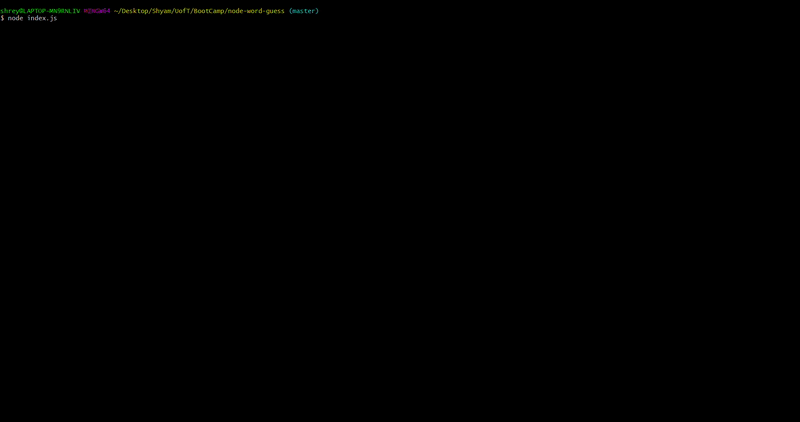

# Word Guess - A Node JS Game

## Getting Started

These instructions will get you a copy of the game up and running on your local machine for development and testing purposes.

This is a node application using JS constructors that generates a word randomly and allows you to guess. You will have 8 chances to guess it correctly or else you lose.

## Application Folder structure

```
.
|-- README.md
|-- package-lock.json
|-- package.json
|-- index.js
|-- letter.js
`-- word.js

```
## Prerequisites

- Verify you have node installed.
  ```
  $ node --version
  ```
- Download the repository to your computer
- Install dependencies using the Node Package Manager
  ```
  $ npm install
  ```

## How to play the game

 


